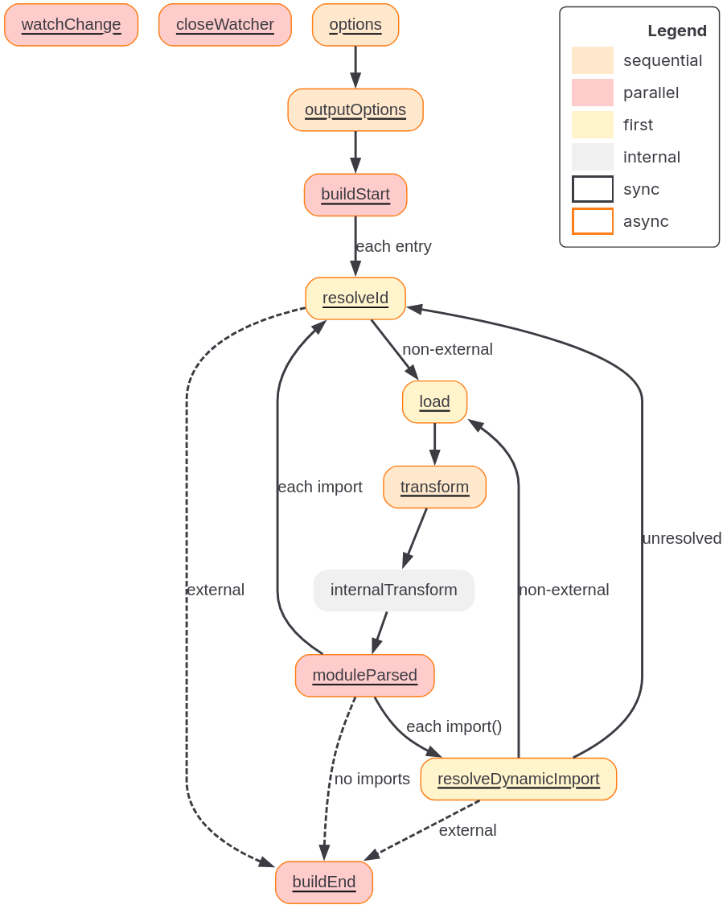
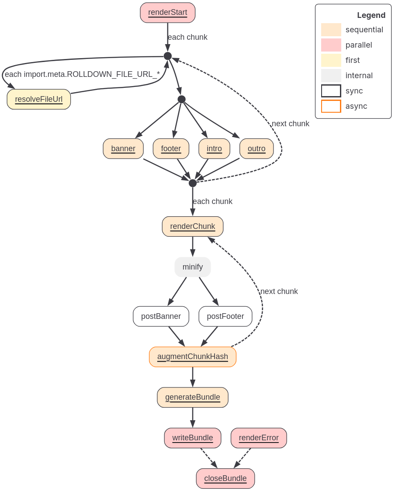

# Rolldown Plugin

References:

- [rolldown.rs](https://rolldown.rs/apis/plugin-api)
- [Plugin compatibility tracking](https://github.com/rolldown/rolldown/issues/819).

## Overview

Plugins allow customizing Rolldown's behavior. Some use cases:

1. Transpile code before bundling.
2. Shim built-in modules.
3. Inject virtual modules.

Rolldown's plugin interface is almost fully compatible with Rollup's. (For context, Rolldown is a rust migration of Rollup, if I recall correctly)

By definition:

1. A plugin is just an object that satisfies the specific plugin interface of Rolldown.
2. Typically it is distributed as a package that exports a factory function: The function takes plugin-specific options, returns the plugin object.

> Remark: I have seen plugins registered like this

```json
{
  plugins: [
    plugin(options) // `plugin` is the factory function that creates a plugin object
  ]
}
```

See an example here: https://rolldown.rs/apis/plugin-api#example (there's a notice about using **hook filters** where possible). Essentially:

1. The plugin package exports a plugin factory.
2. The plugin factory returns a plugin object.

## Conventions

1.  Naming: Plugin names should be prefixed with `rolldown-plugin-`.
2.  `package.json` keywords: Include `rolldown-plugin`.
3.  Source mappings should be correctly output.
4.  Virtual modules have their own conventions (see below).

    4.1. User-facing ID should be prefixed with `virtual:`.

         Example: `virtual:example`, `virtual:posts/helpers`.

    4.2. Use the plugin name as a namespace to avoid collisions.

         Example: `rolldown-plugin-posts` uses `virtual:posts`.

    4.3. Prefix the resolved ID with `\0` (null byte).

         -> This tells other plugins and Rolldown itself "this is virtual, don't try to resolve it on disk".S

         -> Sourcemaps also use this to distinguish virtual modules from real files.

    > Note:
    >
    > - Modules derived from a real file (like submodules from `.vue` or `.svelte` SFCs) should NOT use the `\0` prefix.
    > - Using it would break sourcemaps, since those submodules can be mapped back to the actual file on disk.

## Plugin Interface

The plugin object has:

- One required property: `name`.
- Everything else is optional hooks.

### Hooks

> Definition: Hooks are **methods** on **the plugin object** that **Rolldown calls** at **various stages of the build**.

Basically, it is something like this:

```json
{
  name: "...",
  hook1 () { console.log("Rolldown will call this at a known point during the buld") }
}
```

Hooks can:

- Affect how a build runs.
- Provide info about it.
- Modify it after completion.

When multiple plugins define the same hook (e.g. both `pluginA` and `pluginB` define `transform`), the **hook's kind** determines **how Rolldown coordinates them**.

The type is fixed per hook in Rolldown's spec, not chosen by the plugin author. For example, `resolveId` is always `first`, `transform` is always `sequential`. The plugin author just defines the method, and Rolldown knows how to coordinate it.

The following specifies the hook kinds:

- **`async`**:
  - The hook **may** return a Promise resolving to the same type of value.
  - Otherwise it is **`sync`**.
- **`first`**:
  - Plugins implementing this hook run sequentially until one returns a non-`null`/non-`undefined` value.
  - The rest are skipped.
- **`sequential`**:
  - All plugins run in the specificed plugin order.
  - If `async`, each waits for the previous to resolve.
- **`parallel`**:
  - All plugins run in the specified plugin order.
  - If `async`, they run concurrently (don't wait for each other).

> Remark: A hook can also be specified as an object with a `handler` property instead of a plain method. This is the `ObjectHook` form, which allows attaching additional metadata to control behavior (e.g. hook filters).

There are **two types of hooks**:

1. **Build hooks**: Run during the build phase.
2. **Output generation hooks**: Run during output generation.

> Remark: Ok, following convention, we will distinguish between:
>
> - Hook kind: Rolldown specification of how a defined hook is coordinated if multiple plugins define the hook.
> - Hook type: Rolldown specification of when the hook is run.

### Build Hooks

**Build hooks** are concerned with:

- Locating
- Providing
- Transforming

**input files** before Rolldown processes them.

> Remarks: So basically, a build hooks can either **provide an input** or **transform an existing input**.

The lifecycle:



- First hook: `options`.
- Last hook: always `buildEnd`.
- If a build error occurs, `closeBundle` is called after `buildEnd`.

> Remark: There is an internal step called `internalTransform` in Rolldown's pipeline graph. This is NOT a plugin hook. It is where Rolldown transforms non-JS code to JS.

In watch mode:

- `watchChange` can be triggered at any time to notify that a new run will start once the current run finishes its outputs.
- `closeWatcher` is triggered when the watcher closes.

> The following are supported by Rollup but not Rolldown:
>
> - `shouldTransformCachedModule` ([rolldown#4389](https://github.com/rolldown/rolldown/issues/4389)).

### Output Generation Hooks

**Output generation hooks**:

- Provide information about a generated bundle.
- Modify a build once complete (Post-transform).

Plugins that **ONLY use output generation hooks** can also be passed in via the **output options**, so they run **only for certain outputs**.

The lifecycle:



- First hook: `renderStart`.
- Last hook depends on the outcome:
  - `generateBundle` if output was successfully generated via `bundle.generate(...)`.
  - `writeBundle` if output was successfully generated via `bundle.write(...)`.
  - `renderError` if an error occurred during output generation.

> Remark: `bundle.generate()` produces the output in memory only. `bundle.write()` does the same but also writes files to disk. So `generateBundle` fires in both cases, while `writeBundle` only fires when files are actually written. The sequence for `bundle.write()` is: `generateBundle` then `writeBundle`.

- `closeBundle` can be called as the very last hook, but the user must manually call `bundle.close()` to trigger it. The CLI always does this automatically.

> Remark: `minify` in the pipeline graph is NOT a plugin hook. It is the step where Rolldown runs the minifier. Similarly, `postBanner` and `postFooter` are output options, not hooks (unlike `banner` and `footer` which do have corresponding hooks).

> The following are supported by Rollup but not Rolldown:
>
> - `resolveImportMeta` ([rolldown#1010](https://github.com/rolldown/rolldown/issues/1010)).
> - `renderDynamicImport` ([rolldown#4532](https://github.com/rolldown/rolldown/issues/4532)).
